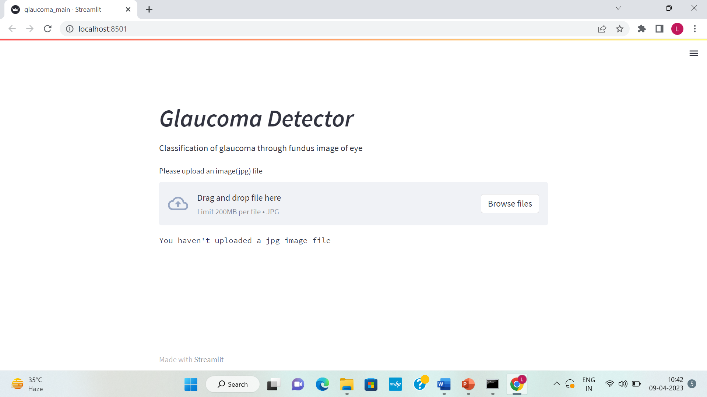
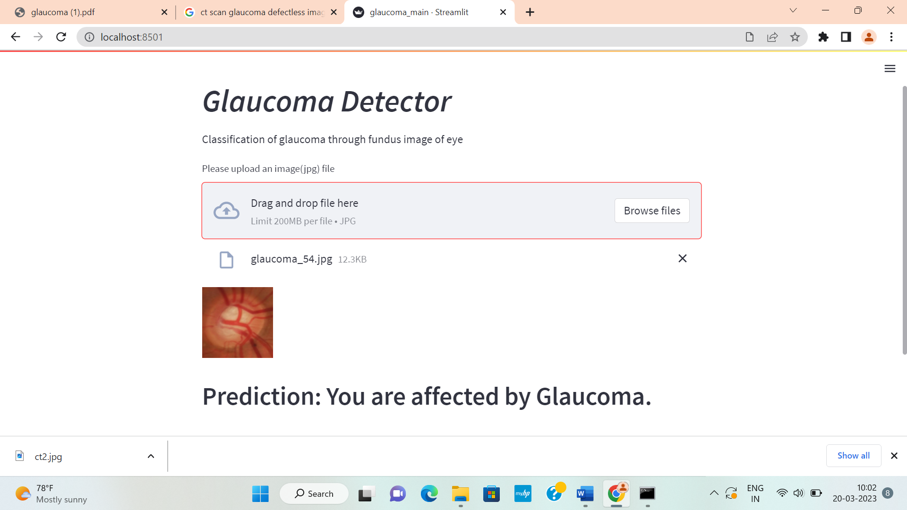
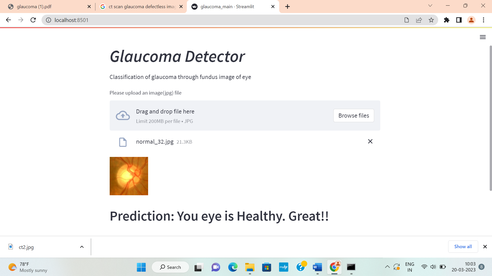

# Glaucoma-Detection
# Glaucoma Detection Project

## Description
This project is a deep learning-based application designed to detect glaucoma from fundus images of the eye. Using a trained TensorFlow model, the system classifies images into **Healthy** or **Glaucoma-affected**, assisting in early diagnosis of this serious eye condition. The user interface is built with Streamlit for ease of use, allowing users to upload images and get instant results.

The aim of this project is to contribute to healthcare innovation by leveraging artificial intelligence to make early glaucoma detection more accessible and efficient.

## Key Features
- **Deep Learning Model**: A pre-trained TensorFlow model powers the classification process.
- **Interactive Interface**: The Streamlit-based UI is simple and user-friendly.
- **Image Visualization**: Uploaded images are displayed for real-time feedback.
- **Fast Results**: Instantly determines the health status of the eye using fundus images.

## Purpose
This project was developed to:
1. Enhance early detection of glaucoma using AI technologies.
2. Create a user-friendly platform for ophthalmologists and patients alike.
3. Explore the potential of machine learning in healthcare applications.

# After runing the page we look

# if user give a defacted unhealthy image then the look

# if user give a non defacted healthy image then the look
